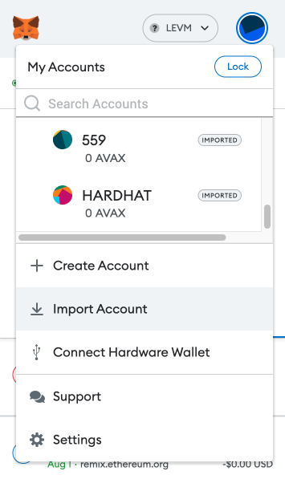
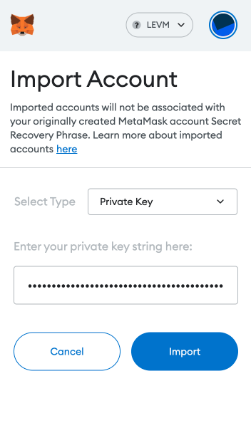
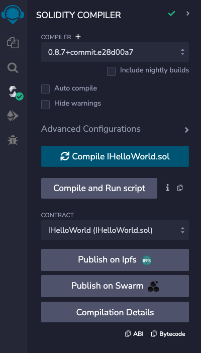
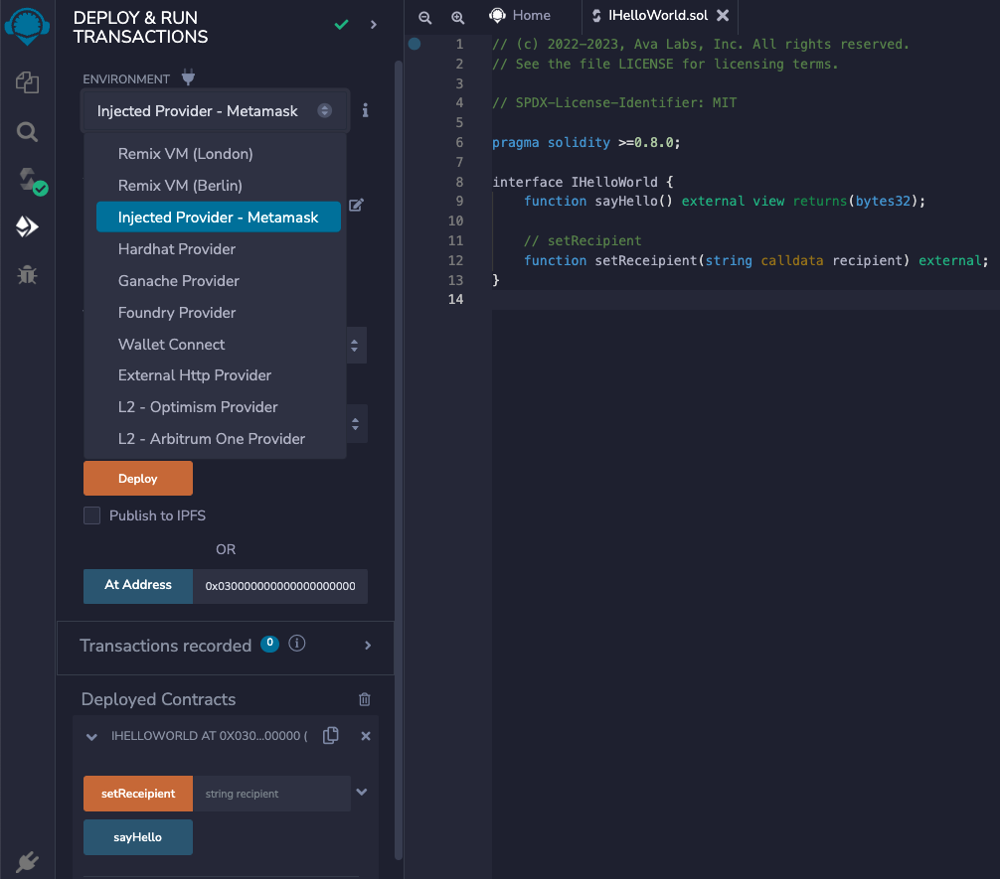
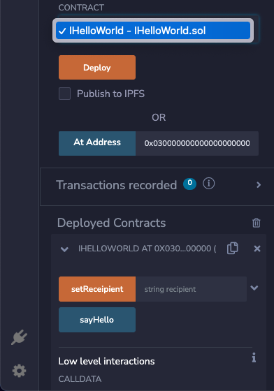

# Create a Stateful Precompile

Stateful Precompiles offer a novel interface for subnet developers to add functionality to their EVM chain without writing a single line of Solidity. Stateful Precompiles integrate natively within the EVM by building on top of the interface offered by EVM precompiles, while adding in state access for an expanded range of possibilities. This allows developers and users to benefit from the ability to create functionality otherwise impossible within the EVM while also making smart contracts more performant and gas efficient.

This tutorial will walk you through the full development workflow of creating a new Stateful Precompile by building a toy example: "Hello World Stateful Precompile".

## Getting Started

:::note
 Please skip this section if you have already cloned [`subnet-evm`](https://github.com/ava-labs/subnet-evm).
:::
To get started, we'll assume that you have already cloned [AvalancheGo](https://github.com/ava-labs/avalanchego) into the default location within your `$GOPATH`. We'll start out by going into the parent directory of `avalanchego`, so that we can clone `subnet-evm` to sit adjacent to `avalanchego`.

```bash
cd $GOPATH/src/github.com/ava-labs
git clone https://github.com/ava-labs/subnet-evm.git
cd subnet-evm
```

Now that we've cloned `subnet-evm`, you should open it in your editor of choice and we'll get started implementing our "Hello World" application.

## Solidity Interface

Now it's time to implement the Stateful Precompile. To start out, let's define the Solidity interface that we want the precompile to implement.

For HelloWorld, we will implement two functions `sayHello()` and `setRecipient(string calldata recipient)`.

IHelloWorld.sol
```ts
// (c) 2022-2023, Ava Labs, Inc. All rights reserved.
// See the file LICENSE for licensing terms.

// SPDX-License-Identifier: MIT

pragma solidity >=0.8.0;

interface IHelloWorld {
    function sayHello() external view returns(bytes32);

    // setRecipient
    function setReceipient(string calldata recipient) external;
}
```

`sayHello` will simply return a "Hello ..." string to the caller and `setRecipient` will set the latter half of the string returned by `sayHello`.

Once we've implemented the Solidity interface, it's time to set up the contract itself.

## Precompile Implementation

Next well implement the Precompile contract into subnet-evm

### Add a new address for the Stateful Precompile
At approximately [line 43](https://github.com/ava-labs/subnet-evm/blob/master/precompile/params.go#L38) in `precompile/params.go` 

```go
var (
	ContractDeployerAllowListAddress = common.HexToAddress("0x0200000000000000000000000000000000000000")
	ContractNativeMinterAddress      = common.HexToAddress("0x0200000000000000000000000000000000000001")
	TxAllowListAddress               = common.HexToAddress("0x0200000000000000000000000000000000000002")
	FeeConfigManagerAddress          = common.HexToAddress("0x0200000000000000000000000000000000000003")

	UsedAddresses = []common.Address{
		ContractDeployerAllowListAddress,
		ContractNativeMinterAddress,
		TxAllowListAddress,
		FeeConfigManagerAddress,
	}
```

add a HelloWorld address to `var` and then add the adress to `UsedAddresses`.

```diff
var (
	ContractDeployerAllowListAddress = common.HexToAddress("0x0200000000000000000000000000000000000000")
	ContractNativeMinterAddress      = common.HexToAddress("0x0200000000000000000000000000000000000001")
	TxAllowListAddress               = common.HexToAddress("0x0200000000000000000000000000000000000002")
	FeeConfigManagerAddress          = common.HexToAddress("0x0200000000000000000000000000000000000003")
+	HelloWorldAddress                = common.HexToAddress("0x0200000000000000000000000000000000000004")

	UsedAddresses = []common.Address{
		ContractDeployerAllowListAddress,
		ContractNativeMinterAddress,
		TxAllowListAddress,
		FeeConfigManagerAddress,
+       HelloWorldAddress
	}
```


### Create a New Precompile Contract

Now let's create a new Precompile, [`hello_world.go`](https://github.com/ava-labs/subnet-evm/blob/precompile-hello-world/precompile/hello_world.go), inside of the `precompile` directory.

First, we implement the full config and contract interface with methods to fill in and type checks so everything passes.

```go
// (c) 2019-2020, Ava Labs, Inc. All rights reserved.
// See the file LICENSE for licensing terms.

package precompile

import (
	"errors"
	"fmt"
	"math/big"
	"strings"

	hello "github.com/ava-labs/subnet-evm/precompile/hello/contracts"
	"github.com/ava-labs/subnet-evm/vmerrs"
	"github.com/ethereum/go-ethereum/accounts/abi"
	"github.com/ethereum/go-ethereum/common"
)
```

Next, create the function selectors for [`sayHello` and `setRecipient`](#solidity-interface) as vars. 

```go
var (
	_                            StatefulPrecompileConfig    = &HelloWorldConfig{}
	ContractHelloWorldPrecompile StatefulPrecompiledContract = createHelloWorldPrecompile()

	helloWorldSignature             = CalculateFunctionSelector("sayHello()")
	setHelloWorldRecipientSignature = CalculateFunctionSelector("setGreeting(string)")

	nameKey       = common.BytesToHash([]byte("recipient"))
	helloWorldStr = "Hello World!"

	ErrInvalidGreeting = errors.New("invalid input length to say hello")

	helloABI abi.ABI // The ABI for the hello world interface
)

func init() {
	parsed, err := abi.JSON(strings.NewReader(hello.HelloWorldABI))
	if err != nil {
		panic(err)
	}

	helloABI = parsed

}
```

Next, we implement the actual `BlockTimestamp`, `Address`, and `Contract` functions to return the singleton contract.

:::note Singleton should be safe to call concurrently
:::
```go
type HelloWorldConfig struct {
	BlockTimestamp *big.Int `json:"blockTimestamp"`
}

// Address returns the address of the precompile
func (h *HelloWorldConfig) Address() common.Address { return HelloWorldAddress }

// Return the timestamp at which the precompile is enabled or nil, if it is never enabled
func (h *HelloWorldConfig) Timestamp() *big.Int { return h.BlockTimestamp }

// Return the precompile contract
func (h *HelloWorldConfig) Contract() StatefulPrecompiledContract {
	return ContractHelloWorldPrecompile
}
```

After this, we implement the `Configure` function to set up the address space of the precompile - this will set the original `Recipient` value in the state

```go
func (h *HelloWorldConfig) Configure(stateDB StateDB) {
	// This will be called in the first block where HelloWorld stateful precompile is enabled.
	// 1) If BlockTimestamp is nil, this will not be called
	// 2) If BlockTimestamp is 0, this will be called while setting up the genesis block
	// 3) If BlockTimestamp is 1000, this will be called while processing the first block whose timestamp is >= 1000
	//
	// Set the initial value under [nameKey] to "Hello World!"
	SetGreeting(stateDB, helloWorldStr)
}

```

Now we implement `packer/unpacker` functions and two functions `sayHello` and `setRecipient` to perform the actual functionality following the [interface](#solidity-interface).

```go
// PackSayHelloInput returns the calldata necessary to call HelloWorld's sayHello
func PackSayHelloInput() ([]byte, error) {
	return (helloABI.Pack("sayHello"))
}

// Arguments are passed in to functions according to the ABI specification: https://docs.soliditylang.org/en/latest/abi-spec.html.
// Therefore, we maintain compatibility with Solidity by following the same specification while encoding/decoding arguments.
func PackHelloWorldSetGreetingInput(name string) ([]byte, error) {
	if len([]byte(name)) > common.HashLength {
		return nil, fmt.Errorf("cannot pack hello world input with string: %s", name)
	}
	return helloABI.Pack("setGreeting", name)
}

// UnpackHelloWorldInput unpacks the recipient string from the hello world input
func UnpackHelloWorldSetGreetingInput(input []byte) (string, error) {
	res, err := helloABI.Methods["setGreeting"].Inputs.Unpack(input)
	if err != nil {
		return "", err
	}

	if len(res) != 1 {
		return "", fmt.Errorf("unexpected response length: %d", len(res))
	}
	str, ok := res[0].(string)
	if !ok {
		return "", fmt.Errorf("unexpected response type: %T of %v", res[0], res[0])
	}

	byteStr := []byte(str)
	if len(byteStr) > common.HashLength {
		return "", fmt.Errorf("cannot unpack string of byte length %d", len(byteStr))
	}

	return str, nil
}

func GetGreeting(state StateDB) string {
	value := state.GetState(HelloWorldAddress, nameKey)
	b := value.Bytes()
	trimmedbytes := common.TrimLeftZeroes(b)
	return string(trimmedbytes)
}

// SetGreeting sets the recipient for the hello world precompile
func SetGreeting(state StateDB, recipient string) {
	res := common.LeftPadBytes([]byte(recipient), common.HashLength)
	state.SetState(HelloWorldAddress, nameKey, common.BytesToHash(res))
}

// sayHello is the execution function of "sayHello()"
func sayHello(accessibleState PrecompileAccessibleState, caller common.Address, addr common.Address, input []byte, suppliedGas uint64, readOnly bool) (ret []byte, remainingGas uint64, err error) {
	if len(input) != 0 {
		return nil, 0, fmt.Errorf("%w: %d", ErrInvalidGreeting, len(input))
	}
	remainingGas, err = deductGas(suppliedGas, HelloWorldGasCost)
	if err != nil {
		return nil, 0, err
	}

	recipient := GetGreeting(accessibleState.GetStateDB())

	output, err := helloABI.Methods["sayHello"].Outputs.Pack(recipient)
	if err != nil {
		return nil, remainingGas, err
	}
	return output, remainingGas, nil
}

// setGreeting is the execution function of "SetGreeting(name string)" and sets the recipient in the string returned by hello world
func setGreeting(accessibleState PrecompileAccessibleState, caller common.Address, addr common.Address, input []byte, suppliedGas uint64, readOnly bool) (ret []byte, remainingGas uint64, err error) {
	recipient, err := UnpackHelloWorldSetGreetingInput(input)
	if err != nil {
		return nil, 0, err
	}
	remainingGas, err = deductGas(suppliedGas, SetGreetingGasCost)
	if err != nil {
		return nil, 0, err
	}
	if readOnly {
		return nil, 0, vmerrs.ErrWriteProtection
	}

	SetGreeting(accessibleState.GetStateDB(), recipient)
	return []byte{}, remainingGas, nil
}
```
Finally, we implement `createHelloWorldPrecompile` which simply wraps these two functions together into one contract.

```go
// createHelloWorldPrecompile returns the StatefulPrecompile contract that implements the HelloWorld interface from solidity
func createHelloWorldPrecompile() StatefulPrecompiledContract {
	return newStatefulPrecompileWithFunctionSelectors(nil, []*statefulPrecompileFunction{
		newStatefulPrecompileFunction(helloWorldSignature, sayHello),
		newStatefulPrecompileFunction(setHelloWorldRecipientSignature, setGreeting),
	})
}
```

Now its time to update the config to return the actual contract.

### Add the Precompile to the Chain Config

First, we add [`precompile.HelloWorldConfig`](https://github.com/ava-labs/subnet-evm/blob/precompile-hello-world/params/config.go#)  to `params/config.go` in the same way as for the other Precompiles.

TODO: add code differences to `config.go` from subnet-evm master branch to hello world implementation

```go
<ORIGINAL-CODE-HERE>
```

```diff
<ADD-UPDATE-HERE>
```
2. Add to String() function (@Dev Is this still needed? Reference to [master branch implementation here](https://github.com/ava-labs/subnet-evm/blob/master/params/config.go#L139) )

Next, at around line 252 we add the `IsHelloWorld` function.
```go
// IsHelloWorld returns whether [blockTimestamp] is either equal to the HelloWorld fork block timestamp or greater.
func (c *ChainConfig) IsHelloWorld(blockTimestamp *big.Int) bool {
	return utils.IsForked(c.HelloWorldConfig.Timestamp(), blockTimestamp)
}
```

Now, at around Line 427 we add the `HelloWorld` implementation to `checkCompatible` to ensure that we do not allow invalid upgrades. (@Dev Is this still needed? Reference to [master branch implementation here](https://github.com/ava-labs/subnet-evm/blob/master/params/config.go#L255) )

```go
// Check that the configuration of the HelloWorld config is compatible.
if isForkIncompatible(c.HelloWorldConfig.Timestamp(), newcfg.HelloWorldConfig.Timestamp(), headTimestamp) {
    return newCompatError("HelloWorld fork block timestamp", c.HelloWorldConfig.Timestamp(), newcfg.HelloWorldConfig.Timestamp())
```


Next, at around Line 487, we add `IsHelloWorld` as a `rules` type.

```diff
type Rules struct {
	ChainID                                                 *big.Int
	IsHomestead, IsEIP150, IsEIP155, IsEIP158               bool
	IsByzantium, IsConstantinople, IsPetersburg, IsIstanbul bool

	// Rules for Avalanche releases
	IsSubnetEVM bool

	IsContractDeployerAllowListEnabled bool
	IsContractNativeMinterEnabled      bool
	IsTxAllowListEnabled               bool
	IsFeeConfigManagerEnabled          bool
+	IsHelloWorld                       bool

	// Precompiles maps addresses to stateful precompiled contracts that are enabled
	// for this rule set.
	// Note: none of these addresses should conflict with the address space used by
	// any existing precompiles.
	Precompiles map[common.Address]precompile.StatefulPrecompiledContract
}
```

Next, at about Line 490 add `IsHelloWorld` to `AvalancheRules`.

```diff
func (c *ChainConfig) AvalancheRules(blockNum, blockTimestamp *big.Int) Rules {
	rules := c.rules(blockNum)

	rules.IsSubnetEVM = c.IsSubnetEVM(blockTimestamp)
	rules.IsContractDeployerAllowListEnabled = c.IsContractDeployerAllowList(blockTimestamp)
	rules.IsContractNativeMinterEnabled = c.IsContractNativeMinter(blockTimestamp)
	rules.IsTxAllowListEnabled = c.IsTxAllowList(blockTimestamp)
	rules.IsFeeConfigManagerEnabled = c.IsFeeConfigManager(blockTimestamp)
+   rules.IsHelloWorld = c.IsHelloWorld(blockTimestamp)
```
7. Add to `enabledStatefulPrecompiles()` so that it will be activated correctly( @Dev Is this still needed? Reference to [master branch implementation here](https://github.com/ava-labs/subnet-evm/blob/master/params/config.go#L526) )

## Writing Stateful Precompile Unit Tests

Follow the same style in `core/stateful_precompile_test.go` to add unit tests:

Lets take a look at the test implementation.

First, we define the environment before each task is executed.
```go

func TestHelloWorld(t *testing.T) {
	type test struct {
		caller         common.Address
		precompileAddr common.Address
		input          func() []byte
		suppliedGas    uint64
		readOnly       bool

		expectedRes []byte
		expectedErr string

		assertState func(t *testing.T, state *state.StateDB)
	}

	addr := common.HexToAddress("0x8db97C7cEcE249c2b98bDC0226Cc4C2A57BF52FC")
	modifiedGreeting := "Hey there sports fan!"
```

Here we test `sayHello()` by ensuring that the return data is accurate. 

```go
	for name, test := range map[string]test{
		"sayHello": {
			caller:         addr,
			precompileAddr: precompile.HelloWorldAddress,
			input: func() []byte {
				input, err := precompile.PackSayHelloInput()
				if err != nil {
					panic(err)
				}
				return input
			},
			suppliedGas: precompile.HelloWorldGasCost,
			readOnly:    false,
			expectedRes: []byte("Hello World!"),
			assertState: func(t *testing.T, state *state.StateDB) {},
		},
		"sayHello readOnly": {
			caller:         addr,
			precompileAddr: precompile.HelloWorldAddress,
			input: func() []byte {
				input, err := precompile.PackSayHelloInput()
				if err != nil {
					panic(err)
				}
				return input
			},
			suppliedGas: precompile.HelloWorldGasCost,
			readOnly:    true,
			expectedRes: []byte("Hello World!"),
			assertState: func(t *testing.T, state *state.StateDB) {},
		},
```
Next we test the Set Recipient functionality.
```go
		"set greeting": {
			caller:         addr,
			precompileAddr: precompile.HelloWorldAddress,
			input: func() []byte {
				input, err := precompile.PackHelloWorldSetGreetingInput(modifiedGreeting)
				if err != nil {
					panic(err)
				}
				return input
			},
			suppliedGas: precompile.SetGreetingGasCost,
			readOnly:    false,
			expectedRes: []byte{},
			assertState: func(t *testing.T, state *state.StateDB) {
				greeting := precompile.GetGreeting(state)
				assert.Equal(t, modifiedGreeting, greeting)
			},
		},
		"set greeting readOnly": {
			caller:         addr,
			precompileAddr: precompile.HelloWorldAddress,
			input: func() []byte {
				input, err := precompile.PackHelloWorldSetGreetingInput(modifiedGreeting)
				if err != nil {
					panic(err)
				}
				return input
			},
			suppliedGas: precompile.SetGreetingGasCost,
			readOnly:    true,
			expectedErr: vmerrs.ErrWriteProtection.Error(),
		},
	} {
```

Next we define our tests run time environment and expected results.
```go
		t.Run(name, func(t *testing.T) {
			db := rawdb.NewMemoryDatabase()
			state, err := state.New(common.Hash{}, state.NewDatabase(db), nil)
			if err != nil {
				t.Fatal(err)
			}

			// Set up the state so that each address has the expected permissions at the start.
			config := precompile.HelloWorldConfig{}
			config.Configure(state)
			ret, remainingGas, err := precompile.ContractHelloWorldPrecompile.Run(&mockAccessibleState{state: state}, test.caller, test.precompileAddr, test.input(), test.suppliedGas, test.readOnly)
			if len(test.expectedErr) != 0 {
				if err == nil {
					assert.Failf(t, "run expectedly passed without error", "expected error %q", test.expectedErr)
				} else {
					assert.True(t, strings.Contains(err.Error(), test.expectedErr), "expected error (%s) to contain substring (%s)", err, test.expectedErr)
				}
				return
			}

			if err != nil {
				t.Fatal(err)
			}

			assert.Equal(t, uint64(0), remainingGas)
			assert.Equal(t, test.expectedRes, ret)

			test.assertState(t, state)
		})
	}
}
```

:::note 
we should mention that we can also add tests in [`plugin/evm/vm_test.go`](https://github.com/ava-labs/subnet-evm/blob/master/plugin/evm/vm_test.go) or [`core/blockchain_test.go`](https://github.com/ava-labs/subnet-evm/blob/master/core/blockchain_test.go) if the precompile is intended to modify the behavior of the VM beyond just the state transition it performs ex. TxAllowList blocks addresses from issuing transactions, so this changes the behavior of [`core/tx_pool.go`](https://github.com/ava-labs/subnet-evm/blob/master/core/tx_pool.go) and [`core/state_transition.go`](https://github.com/ava-labs/subnet-evm/blob/master/core/state_transition.go).
:::

## Add HardHat Tests

Add HardHat tasks to e2e tests to show how it can be used from HardHat

## Add HelloWorld to the Subnet-EVM Genesis

Now let's instantiate HelloWorld inside of our Genesis file found in [`run.sh`](https://github.com/ava-labs/subnet-evm/blob/master/scripts/run.sh#L104), the script that allows us to run our custom Subnet-EVM locally. 


```diff
{
  "config": {
    "chainId": $CHAIN_ID,
    "homesteadBlock": 0,
    "eip150Block": 0,
    "eip150Hash": "0x2086799aeebeae135c246c65021c82b4e15a2c451340993aacfd2751886514f0",
    "eip155Block": 0,
    "eip158Block": 0,
    "byzantiumBlock": 0,
    "constantinopleBlock": 0,
    "petersburgBlock": 0,
    "istanbulBlock": 0,
    "muirGlacierBlock": 0,
    "subnetEVMTimestamp": 0,
    "feeConfig": {
      "gasLimit": 20000000,
      "minBaseFee": 1000000000,
      "targetGas": 100000000,
      "baseFeeChangeDenominator": 48,
      "minBlockGasCost": 0,
      "maxBlockGasCost": 10000000,
      "targetBlockRate": 2,
      "blockGasCostStep": 500000
+   },
+   "helloWorldConfig": {
+   "blockTimestamp": 0
+   }
  },
  "alloc": {
    "${GENESIS_ADDRESS:2}": {
      "balance": "0x52B7D2DCC80CD2E4000000"
    }
  },
  "nonce": "0x0",
  "timestamp": "0x0",
  "extraData": "0x00",
  "gasLimit": "0x1312D00",
  "difficulty": "0x0",
  "mixHash": "0x0000000000000000000000000000000000000000000000000000000000000000",
  "coinbase": "0x0000000000000000000000000000000000000000",
  "number": "0x0",
  "gasUsed": "0x0",
  "parentHash": "0x0000000000000000000000000000000000000000000000000000000000000000"
}
```

## Run the Local Subnet-EVM
Now we can test the Precompile locally by launching a Subnet with `run.sh`

```bash
./scripts/run.sh [AVALANCHEGO VERSION] [GENESIS_ADDRESS]
```

`run.sh` uses our Subnet-EVM genesis file to create a Subnet supported by the Go implementation of an Avalanche node, Avalanchego, all on a local network.

```bash
# to start a local 5-node cluster
cd ${HOME}/go/src/github.com/ava-labs/subnet-evm
./scripts/run.sh 1.7.13 0x8db97C7cEcE249c2b98bDC0226Cc4C2A57BF52FC
```

Our Genesis address `0x8db97C7cEcE249c2b98bDC0226Cc4C2A57BF52FC` is a prefunded address on the local network. The private key for this address is `0x56289e99c94b6912bfc12adc093c9b51124f0dc54ac7a766b2bc5ccf558d8027`.

Once the network has bootstrapped, the terminal will print the following:

```bash
cluster is ready!

Logs Directory: /var/folders/0h/v4nrbbsn1vvbr5h2wfrh5h500000gn/T/network-runner-root-data2328077371

EVM Chain ID: 99999
Funded Address: 0x8db97C7cEcE249c2b98bDC0226Cc4C2A57BF52FC
RPC Endpoints:
- http://127.0.0.1:<YOUR-NODE-PORT-HERE>/ext/bc/<YOUR-SUBNET-ID-HERE>/rpc
.
.
.
WS Endpoints:
- ws://127.0.0.1:<YOUR-NODE-PORT-HERE>/ext/bc/<YOUR-SUBNET-ID-HERE>/ws
.
.
.
MetaMask Quick Start:
Funded Address: 0x8db97C7cEcE249c2b98bDC0226Cc4C2A57BF52FC
Network Name: Local EVM
RPC URL: http://127.0.0.1:<YOUR-NODE-PORT-HERE>/ext/bc/<YOUR-SUBNET-ID-HERE>/rpc
Chain ID: 99999
Curreny Symbol: LEVM
network-runner RPC server is running on PID 12345...

use the following command to terminate:

pkill -P 12345
kill -2 12345
pkill -9 -f srEXiWaHuhNyGwPUi444Tu47ZEDwxTWrbQiuD7FmgSAQ6X7Dy
```

You can then ping the local cluster or add the network to MetaMask:

```bash
curl --location --request POST 'http://127.0.0.1:<YOUR-NODE-PORT-HERE>/ext/bc/<YOUR-SUBNET-ID-HERE>/rpc' \
--header 'Content-Type: application/json' \
--data-raw '{
    "jsonrpc": "2.0",
    "method": "eth_blockNumber",
    "params":[],
    "id": 1
}'
```

Response:

```bash
{
  "jsonrpc": "2.0",
  "id": 1,
  "result": "0x0"
}
```

## Connect with Metamask
Now let's connect MetaMask to our local Subnet-EVM. 

We can use the value provided by MetaMask Quick Start to connect with Metamask.

```bash
MetaMask Quick Start:
Funded Address: 0x8db97C7cEcE249c2b98bDC0226Cc4C2A57BF52FC
Network Name: Local EVM
RPC URL: http://127.0.0.1:<YOUR-NODE-PORT-HERE>/ext/bc/<YOUR-SUBNET-ID-HERE>/rpc
Chain ID: 99999
Curreny Symbol: LEVM
```

You can import the account into MetaMask by using the private key, `0x56289e99c94b6912bfc12adc093c9b51124f0dc54ac7a766b2bc5ccf558d8027`.




## Use from Remix
Now lets test calling the interface from [Remix](https://remix.ethereum.org/), an online smart contract IDE.

First, create a new file, `IHelloWorld.sol` and add the following:
```ts
// (c) 2022-2023, Ava Labs, Inc. All rights reserved.
// See the file LICENSE for licensing terms.

// SPDX-License-Identifier: MIT

pragma solidity >=0.8.0;

interface IHelloWorld {
    function sayHello() external view returns(bytes32);

    // setRecipient
    function setReceipient(string calldata recipient) external;
}
```


then, compile the contract in the `Solidity Compiler` tab.



We can choose `Injected Provider - Metamask` from the `Environment` dropdown to connect directly to our Metamask wallet on our Subnet.



Next we can deploy the interface at the address we defined earlier, `0x0300000000000000000000000000000000000000`, and start calling functions.




## Call Directly in a Transaction

Example of how to call it directly from a transaction without going through a smart contract